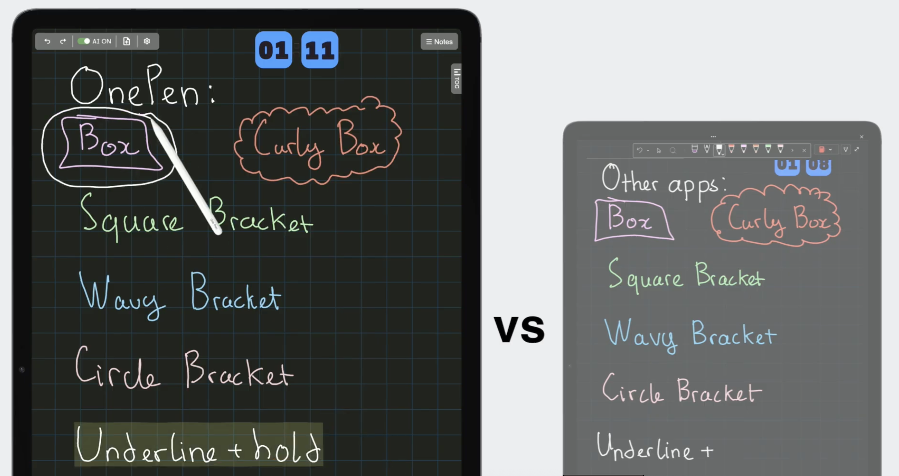
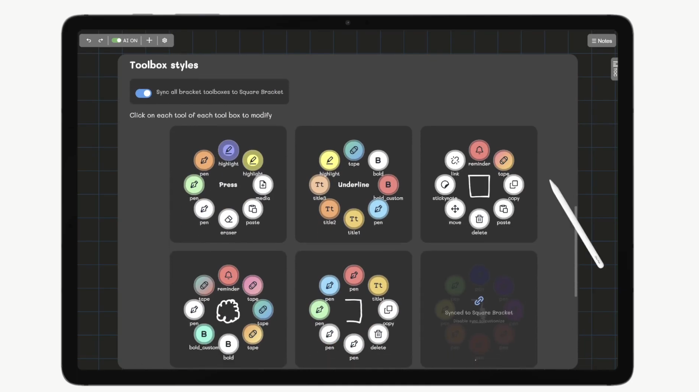

# ✍️ OnePen — AI-Powered Handwriting Note-Taking Web App
Winner — Most Ethical AI hack — HackUMASS XIII

🎥 **Demo video:** [Watch the demo](https://www.youtube.com/watch?v=zuKv9Y6zlVw)

---

## 🚀 Overview
OnePen is a handwriting-based note-taking web app that lets you write, format, and organize notes without ever touching a toolbar. Using AI stroke recognition, it detects gestures, auto-styles content, and allows advanced actions directly from your handwriting. The goal: make note-taking as natural as paper — only smarter.

---

## 🧠 My Contribution
- Built AI stroke recognition models using TensorFlow.js for gesture detection  
- Integrated Canvas frontend with zoom, pan, and HiDPI stylus support  
- Developed Flask backend with Pix2Text integration for handwriting parsing  
- Implemented seamless local autosave via IndexedDB and Google Drive sync

---

## ⚡ Key Features
- ✍️ Modifier Recognition: highlights, deletes, or groups content from handwriting gestures  
- Auto Styling & Coloring: 20+ pen styles via handwriting context  
- Quick Tool Selection: change tools/colors without touching toolbars  
- Sticky Notes Behind Text: hidden notes that appear when clicked  
- Embedded Links: turn strokes into clickable links  
- Math Recognition: parse and solve handwritten formulas in real-time  
- Handwritten Table of Contents & Smart Summarize Tool  
- ☁️ Seamless Sync & Backup across devices

---

## 🛠️ Tech Stack
- Frontend: Canvas-based custom rendering (HTML/CSS/JS)  
- AI Engine: TensorFlow.js hybrid model (image + geometric stroke features)  
- Backend: Flask with Pix2Text + Google Drive API  
- Storage: IndexedDB for local persistence
---

## 🏆 Accomplishments
- Winner — Most Novel Use of AI — HackUMass XIII  
- Collected 4,000+ handwritten training samples, expanded to 36,000+  
- Built real-time handwriting recognition with responsive UI under tight hackathon timeline

---

## 💡 Lessons Learned
- Simplicity is hard: making natural-feeling tools takes longer than adding features  
- Data is everything: thousands of examples needed for accurate gesture recognition  
- Collaboration & persistence are key under hackathon pressure

---

## 🔮 What’s Next
- Real-time multi-user collaboration  
- Gesture-based file management & tagging  
- Advanced AI features: Gemini AI integration, improved Math Solver

---
